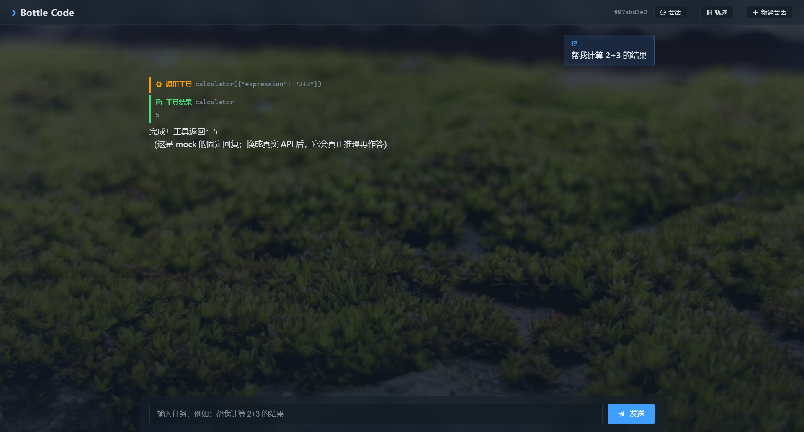
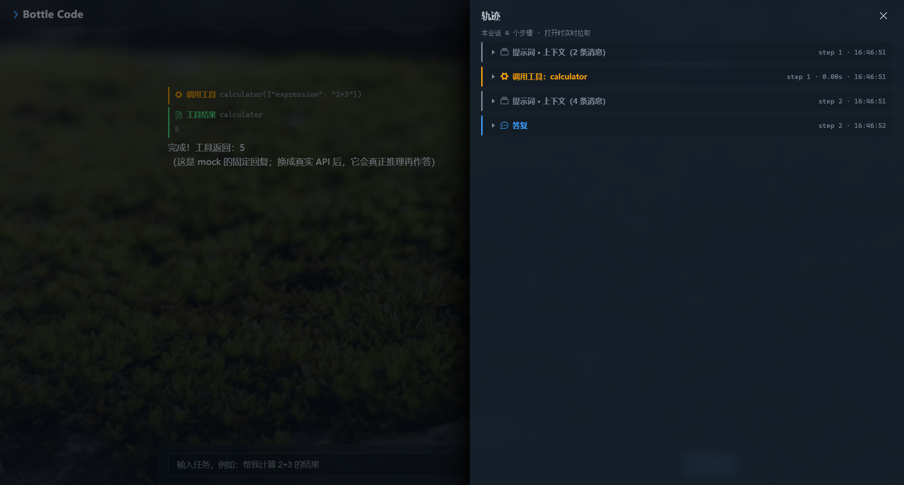
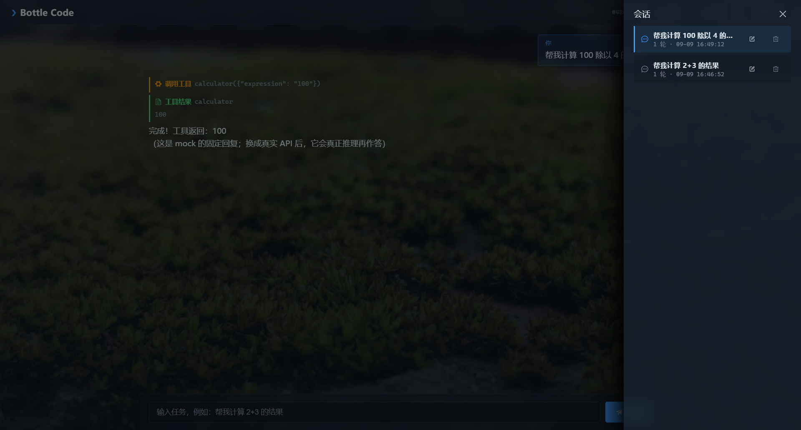

# Bottle Code：从 0 写一个会调用工具的智能体

**中文** | [English](README.en.md)

这个项目是一个**极简但能跑**的 AI Agent 脚手架，适用于初学者（教学大纲位于AGENTS.md）。它故意不引入复杂框架（LangChain / CrewAI / AutoGen），
而是用手写的方式把 Agent 的**核心循环**讲清楚——只有理解了这一层，你去看那些框架才会恍然大悟。

从这块地基往外，它一路长成了**一个能跑真任务、有交互界面的成品**——写代码、查知识库、多 Agent 分工、
接 MCP、跑编码闭环、还有网页版。下面是它的样子。

## 🚀 作品展示（Bottle Code 网页版）

一个从零手写的 Agent 主循环，被逐步打磨成了**可交互的网页版作品**：流式输出 · 轨迹可观测 · 会话持久化。

| 聊天页 | 会话轨迹 | 会话列表 |
|---|---|---|
|  |  |  |
| 深色终端风 · 工具事件时间线 · 流式打字机 · 最终答复 markdown 渲染 | 每步「提示词注入 / 模型思考 / 调用工具 / 工具结果 / 答复」独立成块、可折叠 | 多会话切换 / 改名 / 删除，刷新续聊 |

> 上方截图接**真实 API**（Anthropic Messages API）跑，所以轨迹里能看到模型的**思考块**和真实推理过程。
> 想离线体验：`start.bat mock`（无需 API key，但回复是固定文本、没有思考块）。

## 你已有的知识怎么迁移过来

| 你在 Claude Code / vibe coding 里见过的 | 对应到本项目的哪一个部分 | 说明 |
|---|---|---|
| Skill | 一个/一组工具的**描述 + 触发词** | 工具上方的 `@tool(...)` 装饰器和 `description` 就是“技能说明书” |
| Prompt / 系统提示词 | `agent.py` 里的 `DEFAULT_SYSTEM_PROMPT` | 告诉模型“你是谁、怎么用工具、何时该停” |
| Tool | `tools.py` 里注册的每个函数 | 模型通过 function calling 来“调用”这些能力 |
| 上下文（context） | `Agent.history` 短期记忆 | 每一轮对话 + 上一次工具结果都会被追加进来 |
| 人的“多步思考” | `run()` 里的 for 循环 | 模型决定调工具 → 拿到结果 → 再思考 → 再调/停 |

一句话：**ChatGPT 只会“谈话”，而 Agent 会“谈话 + 做事”。** 区别不在模型，而在于你有没有给它工具，以及有没有循环。

## 核心循环（Agent Loop）

```
用户输入
   ↓
[系统提示词 + 历史 + 用户消息]  →  大模型
   ↓
模型说“我要调用工具”？——是 → 执行工具 → 把结果追加回历史 → 回到大模型
   ↓                                  （这一步可重复很多次）
模型直接给出文字答复？ ——→ 输出最终答案
```

这个循环就是 LangChain / AutoGen 等框架帮你封装的“魔法”。看懂这张图，你就看懂了 80% 的 Agent 原理。

## 目录结构

```
agent-learn/
├── mini_agent/
│   ├── __init__.py
│   ├── agent.py      # Agent 主循环（最核心）
│   ├── llm.py        # 模型后端抽象（真实 API / mock + 流式）
│   ├── tools.py      # 工具注册表 + 各工具实现（每个工具带 risk 等级，含 run_python 沙箱）
│   ├── approval.py   # 审批者抽象（AllowAll / DenyAll / Terminal）
│   ├── knowledge.py  # 最小版 RAG（切块 + 向量 + 检索）
│   ├── knowledge_embed.py  # 第9课 生产级 RAG（embedding + Chroma + 混合检索）
│   ├── roles.py      # 多 Agent 分工（规划者/执行者/评审者 + 编排器）
│   ├── mcp_client.py # MCP 客户端适配器（把外部 MCP 工具挂进 Agent）
│   ├── audit.py      # 审计日志（append-only JSONL + 轨迹渲染）
│   ├── codeops.py    # ★ Bottle Code 合成层（Orchestrator + MCP + 审计）
│   └── main.py       # 命令行入口
├── web/              # ★ Bottle Code 网页版（第10课）
│   ├── server.py     #   FastAPI + SSE 后端（/api/chat · 会话/轨迹接口）
│   └── src/          #   Vue 3 + Vite 前端（聊天页 / 轨迹抽屉 / 会话抽屉）
├── start.bat         # ★ 一键启动（后端 :8000 + 前端 :5173，各开一个窗口）
├── knowledge/        # 知识库文档（用 build_kb.py 建索引）
├── examples/
│   ├── mock_demo.py        # 离线演示脚本
│   ├── build_kb.py         # 建立知识库向量索引
│   ├── multi_agent_demo.py # 多 Agent 分工演示
│   ├── mcp_server.py       # 自定义 MCP server（仓库统计）
│   ├── mcp_demo.py         # 把 MCP 工具接进 Agent 的演示
│   ├── eval_harness.py     # 评测集：给 Agent 打分（4 任务 × 5 维度）
│   ├── lesson7a_hole.py    # 7A 漏洞演示：越权调用被拦截
│   ├── tooling_permissions_demo.py  # 工具层 + 风险分级权限验收（15 项边界，可进 CI）
│   ├── rag_eval.py         # 第9课 检索评估（hit@k 对比三方案）
│   ├── codeops_demo.py     # ★ Bottle Code 演示（MCP + RAG + 多Agent + 写文件）
│   ├── lesson11_demo.py    # 第11课 编码闭环演示（写代码→跑测试→改）
│   ├── lesson11_eval.py    # 练习11A 编码闭环评测器（隐藏测试验证产物）
│   └── stream_demo.py      # 10A 流式输出演示（打字机效果）
├── docs/             # 作品展示素材（screenshots/）
├── memory/           # 长期记忆存放处（notebook.md）
├── scripts/          # 辅助脚本（如密钥检查）
├── .githooks/        # 提交前钩子
├── .env.example
├── LICENSE
└── requirements.txt
```

## 快速开始

### 1. 先离线跑通（不需要 API key）

```
python -m mini_agent.main --provider mock --prompt "帮我计算 2+3 的结果"
```

或者进交互模式：

```
python -m mini_agent.main --provider mock
# 输入：帮我计算 2+3 的结果
# 观察它如何先调用 calculator，再根据结果给出答复
```

### 2. 换到真实大模型

```
pip install -r requirements.txt
cp .env.example .env    # 然后填上 OPENAI_API_KEY
python -m mini_agent.main --provider openai --model gpt-4o-mini
```

`--provider openai` 走的是 OpenAI 兼容的 `/chat/completions` 接口。
只要你手上是用这种协议的服务（DeepSeek / 通义千问 / 本地 Ollama 等），把 `.env` 里的
`OPENAI_BASE_URL` 改成对应地址就能复用同一个代码。

### 3. 启动网页版（第10课 · 交互界面）

在**仓库根目录**运行：

```
start.bat              # 默认 anthropic（真实 API，需 .env 里的 key）
start.bat mock         # 离线可跑，不需要 key
start.bat openai       # OpenAI 兼容后端
```

它会自动检查 `.venv` 与前端依赖、起 FastAPI 后端（:8000）+ Vite 前端（:5173），并各自开一个窗口。
浏览器打开 http://localhost:5173，输入任务，就能看到**流式输出 + 工具事件时间线**。
也可手动分步：

```
.venv/Scripts/python.exe web/server.py --provider mock --port 8000   # 后端
cd web && npm install && npm run dev                                  # 前端（代理 /api → :8000）
```

## 它是怎么工作的（逐文件拆解）

### 1. `tools.py` —— 给 Agent 安装“手脚”

一个工具就是：**函数 + 名字 + 描述 + 参数 JSON Schema + 风险等级**。其中“描述”尤其重要，因为模型是**读描述**而不是读源码来决定要不要调用它的。

`@tool(...)` 装饰器把函数注册进全局表，`get_tool_schemas()` 把整张表翻译成大模型能看懂的 `function calling` 声明。`execute_tool(name, args)` 负责按名字分发并执行。

| 风险等级 | 工具 | 执行层行为 |
|---|---|---|
| `read` | `list_dir` `read_file` `grep` `calculator` `get_current_time` `recall` `kb_search` `final_answer` | 直接放行 |
| `write` | `write_file` `edit_file` `remember` | 需审批 |
| `execute` | `run_shell` `run_python` | 需审批 |

新工具不声明 `risk` 时默认 `write`——**安全默认：漏写就进审批，而不是自动放行**。

两个工具值得单独说：

- **`grep`** 补上了内容检索。没有它，想找一处代码只能 `list_dir` 再逐个 `read_file`，成本是 O(所有文件) 而问题本身是 O(1)。
- **`read_file` / `edit_file` 的配合**：`read_file(path, offset, limit)` 返回带行号的内容，**首行告知"共 N 行，显示 a-b 行"**（治掉旧版砍到 20000 字符却不说明的静默截断）；`edit_file` 做精确字符串替换，且 **`old_string` 必须唯一**、**改之前必须先 `read_file`**。

> 这三件事是同一个设计思想：**能让工具协议保证的事，不要用提示词去求模型自觉。** 「先观测再动手」以前写在规则里靠模型自觉，现在由工具契约强制。

#### 权限：职责边界 + 风险分级

执行层按**顺序**做两道裁决（顺序不能反）：

1. **职责边界**——`allowed_tools` 是硬边界：不在职责工具集里的 `write`/`execute` 一律拦。
   但 **`read` 类工具豁免**——读从不越权，而规则要求「写入后自验证」，把 `read_file` 关掉会让模型没法自证。
2. **风险分级**——过了边界的 `write`/`execute` 还要问 `Approver`：

| Approver | 用在哪 |
|---|---|
| `AllowAllApprover` | 默认（无人环境 / 评测 / CI）。**仍会记一条 `auto-allowed` 轨迹** |
| `DenyAllApprover` | 严格模式，用来验证"危险操作真的被拦住了" |
| `TerminalApprover` | CLI `--approve`：逐次 y/n/a 交互；**读不到输入时 fail-closed 拒绝** |

> 为什么顺序不能反：先判「这活是不是我的」，再判「危不危险」。反过来，模型幻觉调用一个职责外的工具时会直接被送进审批（无人环境下默认放行），7A 挖的那个洞就回来了。
>
> 为什么默认放行要记轨迹：让「没人可问所以自动放行」是一个**有记录、可审计的决定**，而不是静默放行。
>
> 网页版没有同步交互通道（SSE 是单向流，Agent 循环没法"挂起等人回话"），所以只用 `--approval-policy allow|deny` 定策略，不做逐次审批。

> 小练习：自己加一个 `@tool("search_weather", ...)` 吧。你会立刻体会到：给 Agent 加能力 = 加一个函数 + 写清楚描述 + 想清楚它有多危险。

### 2. `llm.py` —— 模型后端

`LLM.chat(messages, tools)` 是唯一接口。Agent 只依赖它，因此你可以随时切换 OpenAI、别的兼容服务，或者一个不花钱的 mock。

- `OpenAIChatLLM`：调用真实的 function calling，返回带 `tool_calls` 的结构。
- `MockLLM`：离线、确定性。它看见“计算”就假装要调 `calculator`，拿到结果后再“假装思考”给个答复。**它的价值是让你在没有 key、没有网络时，也能肉眼看到“循环”的完整过程。**

### 3. `agent.py` —— 主循环

这是整个项目的心脏，却只有一小段：

```
1. 拼消息：system + history
2. 调模型
3. 若模型请求了工具 → 执行 → 把结果追加进 history → 回到第 1 步
4. 若模型直接给出文字 → 返回，结束
```

真正的 Agent 框架（无论多复杂）跑的也是这个循环，只是多了规划、记忆、验证、并行、子代理等“外挂”。

### 4. 两类“记忆”

- **短期记忆**：`Agent.history` + 滑动窗口（`max_context_messages`）。对话太长时只把最近 N 条发给模型，防止上下文爆掉、也避免“忘了开头”。
- **长期记忆（单条事实）**：`remember` / `recall`。把重要事实写进 `memory/notebook.md`，跨会话可检索。
- **长期记忆（RAG）**：`kb_search` + `knowledge.py`。把文档切块、向量化、按相似度检索，让 Agent 基于资料回答并注明来源。

> 三者配合：重要事实用 `remember` 存，整摞资料用 `kb_search` 检索，短期窗口保证长对话不超载。

### 5. 多 Agent 分工（`roles.py`）

单个 Agent 只有“一个脑子”。当任务复杂到需要**同时做多件事、互相审查**时，就把它拆成多个角色：

```
用户任务
   ↓
[规划者] 只拆步，不执行 → 计划步骤
   ↓
[执行者] 真正动手（计算/读写/跑命令）
   ↓
[评审者] 只看结果，判定 ok / retry
   ↓  (retry 则把反馈带回执行者重做)
结构化结果
```

- **分工本质**：给不同角色不同的 `system_prompt`（人设 + 规则）和不同的 `allowed_tools`（职责边界，决定"这活是不是我的"）。
- **消息协议**：角色之间用 JSON 传递 `task / steps / result / verdict / feedback`，而不是散乱的文字。
- **复用第2课循环**：规划者/执行者/评审者都是同一个 `Agent` 类，只是人设和工具不同。

> 试运行：`python examples/multi_agent_demo.py --provider mock`（离线看骨架）或换 `openai-compatible` 用真实模型。

### 6. MCP 接入（`mcp_client.py` + `examples/mcp_server.py`）

**MCP（Model Context Protocol）** 是统一“LLM 应用如何接外部工具/数据”的开放协议，号称“给 AI 的 USB-C”。它把**提供能力**和**使用能力**解耦：

```
Agent（Host/Client）  ⇄  MCP Server（暴露工具/资源/提示）
```

- 我们的 **client 适配器**（`mcp_client.py`）用一个子进程把 MCP server 跑起来，走 stdio 交换**换行分隔的 JSON-RPC** 消息：
  `initialize` → `tools/list`（发现工具）→ `tools/call`（调用工具）。
- 它把每个 MCP 工具**翻译成本项目 Agent 认识的 `Tool`**（名字加 `mcp_` 前缀、参数直接复用 MCP 的 JSON Schema）。
- 于是 **`Agent` 主循环几乎不用改**——它只是多看到几个工具而已，这就是复用第2课循环的威力。

```
# 启动自定义 MCP server（仓库统计）
python examples/mcp_demo.py --provider openai-compatible
```

> 价值：以后给 Bottle Code 加能力（git / 数据库 / 文件系统）只需**挂一个 MCP server**，而不是改 Agent 代码。

### 7. Bottle Code（`codeops.py`）—— 前 6 节的"合体"

把前面所有零件**接线**成一个完整可运行的作品：读代码库 + 查知识库 + 多 Agent 分工 + 自动执行。

```
用户任务（"统计代码量" / "查部署步骤" / "写检查清单"）
   ↓
┌─────────────────────────────────────────────────┐
│ CodeOpsAgent（合成层：只做"接线"，不重写）         │
│  ┌───────────────────────────────────────────┐  │
│  │ Orchestrator（多Agent分工）                │  │
│  │  规划者 → 执行者 → 评审者 → ok/retry        │  │
│  └───────────────────────────────────────────┘  │
│  可靠性层：职责边界 + 风险分级审批 + audit 审计   │
└─────────────────────────────────────────────────┘
   ↓ 工具层
┌──────────┬──────────┬──────────┬──────────────┐
│ 读代码库   │ 查知识库   │ 自动执行   │ MCP 外部能力  │
│ grep      │ kb_search │ edit_file│ mcp_count_loc│
│ read_file │ (RAG)     │ run_shell│ mcp_git_status│
│ list_dir  │           │ run_python│ mcp_list_files│
└──────────┴──────────┴──────────┴──────────────┘
```

- **合成层**（`codeops.py`）只有 ~50 行：注册 MCP 工具 → 追加进执行者白名单 → 给每个角色挂审计 → 暴露一个 `run(task)` 入口。**没有新算法，只有组合**——这就是"复用不是重写"。
- **演示**：`python examples/codeops_demo.py --provider anthropic`，一个任务同时考验 MCP（统计代码量）+ RAG（查部署步骤）+ 写文件（产出部署清单）+ 多 Agent 分工 + 审计。

### 8. 网页版（`web/`）—— 让 Agent 能被"看着干活"

CLI 只看得到最终结果；网页版把 Agent 的**中间过程**变成可见的界面：

```
浏览器（Vue 3 + Element Plus）
   │  POST /api/chat  { message, session_id }
   ▼
FastAPI（web/server.py）
   │  agent.run(stream=True)          ← 10A 的流式事件
   ▼
SSE 事件流：delta（文本增量）/ tool（调用工具）/ result（工具结果）/ done（最终答复）
   │
   ▼
前端按事件类型渲染 → 时间线（思考 / 工具 / 结果 按发生顺序交错）+ markdown 最终答复
```

三个设计要点：

- **流式是事件协议，不是裸文本**：`run(stream=True)` yield 的是 `{"type": "delta" | "tool" | "result"}` 这类结构化事件。
  只有文本的话，前端无法知道"这段字是推理还是答复"——**pending-buffer**：先缓冲 delta，等后续事件来裁决（工具事件 → 前面是推理；`done` → 它就是答复）。
- **展示记录 ≠ 模型上下文**：`Agent.history` 是发给模型的消息（含 `tool_calls`、`content=null` 的工具轮、被 `final_answer` 直接 return 的答复），人看不懂；
  所以另存一份 `chat_logs` 专门给人看。两者分离落盘到 `sessions.json`（原子替换写入），重启后既能看到历史，也能**接着聊**。
- **只改展示层，不动 Agent 核心**：后端把 `final_answer` 的结构化 JSON 清洗成干净文本再下发（`clean_final_answer`），
  但 `Orchestrator` 仍拿到完整 JSON 做评审——展示与协议解耦，改界面不会破坏多 Agent。

> 轨迹抽屉（「轨迹」按钮）读的是该会话 Agent 实例的**内存 trace**（第7课的观测数据）：每步的
> 提示词注入 / 模型思考 / 调用工具 / 工具结果 / 最终答复各自独立成块。默认全部折叠，点开看内容。

## 动手练习（按难度递进）

1. **加一个新工具**：给它加 `@tool("search_weather", ...)`，然后让它回答“今天北京天气怎样？”（先用 mock 调起来，再换真模型）。
2. **加一个“规划”步骤**：在 `run()` 里，当复杂任务第一次进入时，先让模型输出一行 `计划：...`，再开始执行。
3. **加“验证/复查”循环**：让模型用一个 `run_shell` 工具执行并查看结果；如果结果是错误，再让它改一次。这就是很多“代码 Agent”的雏形。
4. **把长期记忆接上向量检索**：把 `recall` 从字符串匹配换成 embedding 相似度检索。
5. **改用 MCP**：把工具定义从“手写 schema”升级成 MCP（Model Context Protocol）服务器，可以让你的 Agent 直接使用一套标准化的外部工具。

## 本项目已覆盖的”进阶能力”（都在 examples/ 里有可运行演示）

| 能力 | 对应实现 | 演示 |
|---|---|---|
| MCP 工具生态 | `mcp_client.py` + `mcp_server.py` | `mcp_demo.py` |
| RAG 检索增强 | `knowledge.py` + `kb_search` | `build_kb.py` |
| 多 Agent 协作 | `roles.py`（规划者/执行者/评审者） | `multi_agent_demo.py` |
| 可观测性 | `audit.py`（trace + append-only JSONL） | 跑任意 demo 后看 `logs/agent.jsonl` |
| 评测 | `eval_harness.py`（4 任务 × 5 维度，退出码可进 CI） | `eval_harness.py --provider mock` |
| 安全与沙箱 | 职责边界 + 风险分级审批 + 路径沙箱 + AST 白名单计算 | `lesson7a_hole.py` / `tooling_permissions_demo.py` |
| 整合 | `codeops.py`（Bottle Code 合成层） | `codeops_demo.py` |
| 网页版 | 流式输出 + FastAPI + SSE + Vue，痕迹可观测、会话落盘 | `web/server.py` / `start.bat` |
| 生产级 RAG | 混合检索（BM25 + 向量 RRF） | `knowledge_embed.py` / `rag_eval.py` |
| 代码编码闭环 | `run_python` 沙箱 + 隐藏测试评测器 | `lesson11_demo.py` / `lesson11_eval.py` |

## 进阶能力（第9~11课 · 已全部完成）

- **第9课 · 生产级 RAG** ✅：embedding（fastembed）+ 向量库（Chroma）+ 混合检索（BM25+向量 RRF）+ 检索评估（`knowledge_embed.py` + `rag_eval.py`）。
- **第10课 · Bottle Code 网页版** ✅：流式输出 + FastAPI 后端 + Vue 前端，把 Bottle Code 变成可交互网页（`web/`）。
- **第11课 · 代码 Agent 闭环** ✅：`run_python` 沙箱执行 + 写代码 → 跑测试 → 改到通过 + 隐藏测试评测器（`lesson11_demo.py` / `lesson11_eval.py`）。

## 接下来还能加什么（待办/灵感）

- **更多 MCP server**：挂上数据库、浏览器、CI 等外部能力，Bottle Code 就能真正"运维"。
- **生产化改造**：`sessions.json` → SQLite/Redis、Element Plus 按需引入、鉴权、HTTPS（当前为教学演示，已知在此留白）。
- **更硬的命令级沙箱**：`run_shell` 目前对 `cat` 读任意文件 / git 仓库操作仍开放，可深化到真正的命令级白名单。
- **web 端异步审批**：目前只给 `--approval-policy allow|deny`。真正的逐次审批要新增 `approval_request` SSE 事件 + `POST /api/approve` 端点 + 让 Agent 循环"挂起等回话"（生成器要可暂停）——难在通道，不在判断。

## 安全提示（重要）

- `calculator` 用 **AST 白名单**求值，**不用 `eval`**。旧版是 `eval(expr, {"__builtins__": {}}, safe_dict)`，而清空 `__builtins__` 挡不住从字面量做属性遍历——`().__class__.__bases__[0].__subclasses__()` 能摸到 `os.system`，实测可直接执行任意命令。AST 白名单下属性访问、下标、lambda、推导式、import 全部不可表达。
- `write_file` / `read_file` 做了路径限制（`_safe_path`），但这还不够。真正的 Agent 一定要有**权限最小化、人工确认、沙箱执行、审计日志**——这四样本项目各有一份最小实现（职责边界 + 风险分级审批 + `run_python` 沙箱 + 审计日志），但都还是**教学级**。
- **敏感路径拒绝**：`read` 类工具豁免职责边界，意味着任何角色的 Agent 都能读 `BASE_DIR`（默认仓库根）内的文件。为此在读内容的工具（`read_file` / `grep`）上加了一道**内容级**拒绝：`.env` / `.git/` / `*.key` / `*.pem` / `*credential*` 这类路径一律不读（返回 `[SENSITIVE]`），与危险等级无关——路径本身就是机密，读都不该读。写路径不受这条影响（写仍受职责边界 + 审批双重约束）。`grep` 走查目录时**静默跳过**敏感文件，而不是让整次搜索报错。

## 小结

你已经亲手实现了 Agent 最核心的骨架。接下来不再是“学知识”，而是“加能力 + 加约束 + 加评测”。祝你玩得开心：）

## 开源许可

本项目使用 [MIT](LICENSE) 许可。

> 发布前请把 `LICENSE` 里的版权人改成你的名字；真实 API key 只放本地 `.env`（已 gitignore）。
> 提交前可跑 `python scripts/check_secrets.py` 做一次敏感信息检查。
